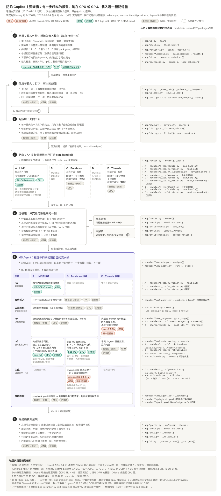

# 架構

> [!IMPORTANT]
> **專題主要架構**（2026-09-24 定案）就是下面這張產品流程圖：從使用者輸入、A～E 模組到 M5 Agent，
> 每一步呼叫的模型、跑在 CPU 或 GPU、載入記憶體還是顯卡記憶體，以及對應的程式碼。
> 其他流程圖已列為廢案，原封不動保存在 [廢案/2026-09-24-流程圖/](廢案/2026-09-24-流程圖/)。

- **網頁版**：[`main-architecture.html`](main-architecture.html)——下載後用瀏覽器開，手機也能看，
  每個檔名都連到 GitHub。線上版 <https://claude.ai/artifact/7MjDu8jaXwsSKGypBB22sY>
  是私人連結，擁有者分享之後才打得開
- **怎麼改**：圖與網頁都由 [`tools/gen_main_architecture.py`](../tools/gen_main_architecture.py) 產生，
  內容只寫在那支檔案的上半部。程式改了、流程變了，改完內容重跑
  `uv run python tools/gen_main_architecture.py`，兩個檔案會一起更新
- **現況**：對到 `a-rag` 的 `2c2662f`，2026-09-24 在 A 的 Mac（M5）實跑確認
  （執行紀錄的步驟順序、`ollama ps`、onnxruntime 的 providers、bge-m3 參數所在的裝置）



## 外殼怎麼運作

| 零件 | 檔案 | 做什麼 |
|---|---|---|
| 註冊表 | `app/registry.py` | 開機掃 `packages/modules/`，讀 `pack.yaml`、呼叫 `health()`、載入。底線開頭的資料夾自動略過 |
| 路由器 | `app/router.py` | 問每個模組 `can_handle()`，比大小。三種結果：交給誰／同時提醒／尚未涵蓋 |
| 解鎖層 | `app/entitlements.py` | 依 `pack.yaml` 的 `plan` 決定能不能用。三條硬規則見下 |
| 輸出檢核 | `app/guards.py` | 高風險沒行動→擋；案例沒編號→丟掉；免責聲明不見→補回來 |
| 介面 | `app/ui.py` | Streamlit。輸入區／結果區／執行紀錄區＋方案切換鈕 |

**外殼不需要懂任何一種詐騙。** 每個模組自己判斷「這像不像我」，外殼只負責比大小 ——
所以新增第六個模組時，外殼一行都不用改。

## 解鎖的三條硬規則

1. 未解鎖的模組命中時，還是要告訴使用者「我們判斷你的情況屬於 X 類，需要解鎖才有完整判讀」——**不能假裝不知道**
2. 風險等級與 165 導流**永遠免費**
3. 解鎖邏輯出錯時要往「**多給**」的方向失敗

規則一是這個產品在倫理上站不站得住的關鍵：一個會因為沒付費就不告訴使用者
「你正在被詐騙」的系統，不該存在。三條都寫成測試在 `tests/test_router_and_shell.py`。

## 介面規格：四個進入點

```python
can_handle(payload) -> float   # 0~1，這個案子有多像我負責的類型。要保守
analyze(payload)    -> Verdict # 完整判讀
info()              -> ModuleInfo
health()            -> HealthReport
```

模組不需要 import 任何基底類別 —— 用 `typing.Protocol` 做結構比對，
簽章對得上就算符合規格。所以模組與外殼之間連 import 關係都沒有。

## 三樣不准自己寫

| 共用工具 | 為什麼 |
|---|---|
| `shared.deid` 去識別化 | 受害者的個資保護不能有五種標準 |
| `shared.models` 模型呼叫（含 OCR 認字） | 五個人必須用同一組模型才能比分數 |
| `shared.eval` 分數計算 | 算法不同分數就不能比 |

執法者是 `tools/check_boundaries.py`：用 AST 掃每個模組資料夾，
擋下 import 模型套件（含 OCR 引擎）／連網套件／別人的模組，以及自己重寫共用三樣的函式名。
pre-commit 與 CI 都會跑。

## 截圖怎麼走

認字是共用的，看懂版面是各模組自己的。

```
使用者輸入（文字 ＋ 0 到 N 張圖）
   │
   ├─ 有圖 → router._read_images()：shared.models.ocr() 每張認一次
   │         回每行的字 ＋ 座標 ＋ 信心分數，以「檔案內容」為鍵放進快取
   ▼
router：逐一問各模組 can_handle()
   │   模組的 M2 呼叫 shared.models.ocr() → 快取命中，不重認
   │   打的字 ＋ 截圖上的字 → 關鍵字打分
   ▼
認領的模組各自跑 M5（analyze_all 並行）
   M2：ocr()（快取命中）→ 版面判斷、併成氣泡、分出誰說的（用座標 ＋ 原圖）
   → 合併文字 → shared.deid → M4 判讀 → M3：bge-m3 查自己的索引 → SLM 生成
   → 外殼的 guards 檢核
```

| 在哪 | 做什麼 | 為什麼放這裡 |
|---|---|---|
| `shared.models.ocr()` | 找出文字行、認字、回座標與信心分數；以內容雜湊快取；引擎常駐不釋放 | 認字跟平台無關。放共用層才能只認一次、錯字率才能互比 |
| `app/router.py` 的 `_read_images()` | 路由前先把每張圖認過一次 | 每個模組的 `can_handle()` 都要看截圖上的字。先認過，後面全是快取命中；認不出來只記一筆降級，不擋路由 |
| 各模組的 `m2_vision.py` | 判斷畫面種類、把幾行併成一塊、分出誰說的 | LINE 的氣泡、FB 的貼文、蝦皮的商品頁完全不同，這些只有模組自己懂 |

幾件容易踩的事：

- **合併文字留在模組做，不在外殼做。** `AnalyzeInput` 是 W1 凍結的，外殼把截圖上的字塞進
  `payload.text` 的話，還在用舊 M2 的模組會把同樣的字算兩次。
- **快取的鍵是檔案內容，不是路徑。** `app/ui.py` 用原始檔名把上傳的圖寫進暫存資料夾，
  兩張都叫 `image.png` 的圖會落在同一個路徑。
- **OCR 回的是原文。** 截圖上的個資都還在，合併之後照樣先過 `shared.deid` 才進判讀。
- **還沒鎖定引擎前，整條路都走降級**：`ocr()` 丟 `ModelNotSelectedError`，外殼記一筆
  `route:ocr` 降級，模組只用打字的內容 —— 跟改版前的行為一樣。

## 「原文不進雲端」怎麼強制

`shared.models.call_cloud()` 只收 `MaskedText` 型別，而 `MaskedText` 只能由
`shared.deid.mask()` 產生。傳 `str` 進去會丟 `RawTextLeakError`。
這條界線是程式強制的，不是註解提醒的。
