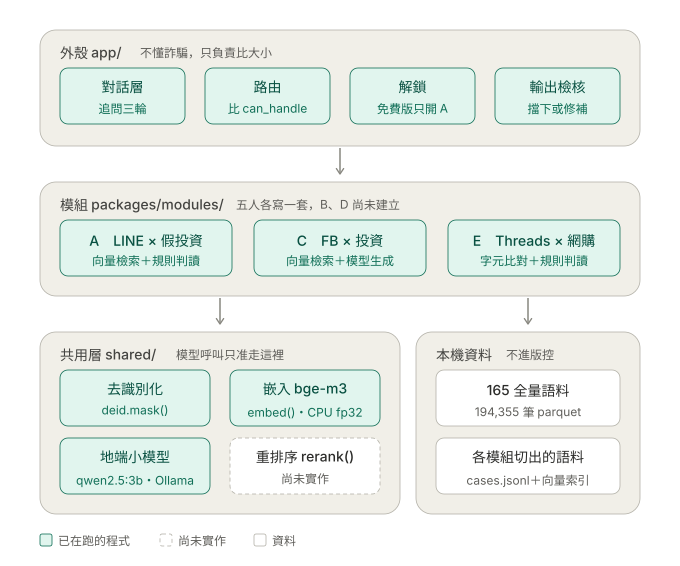
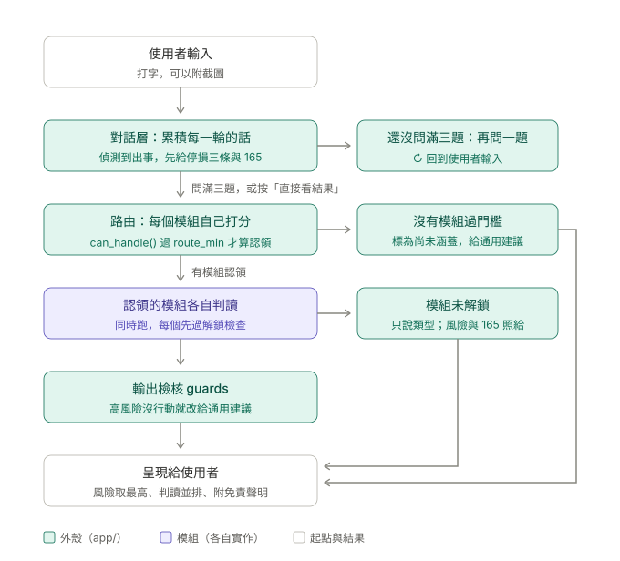
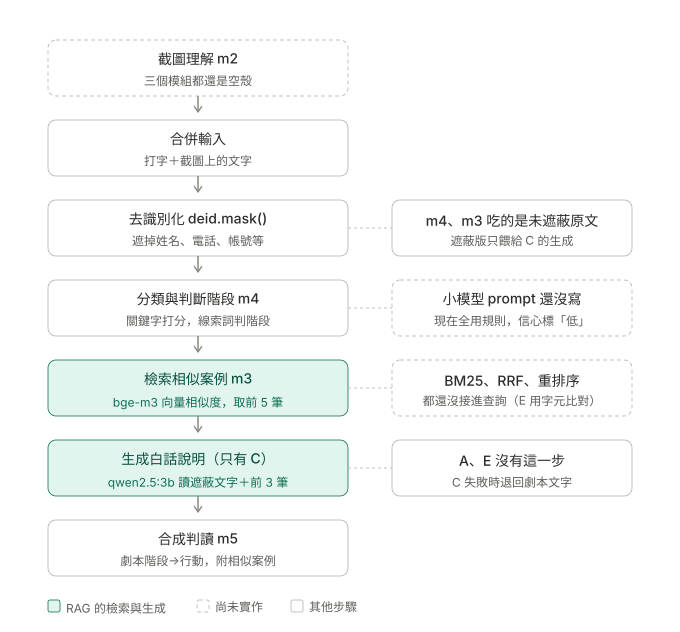

# RAG 架構與輸入流程（現況）

> 對到 2026-09-23，程式碼是 `main` 的 `ba4f3a9`。
> 這份畫的是**程式現在實際怎麼跑**，全部從程式碼追出來，不是說明書規劃的樣子。
> 程式一改這份就會過期 —— 動到外殼、模組流程或共用層時，回來更新圖與第 4 節。

## 1. 系統分層

外殼只負責比分數、檢查解鎖、檢核輸出，完全不碰語料。RAG 的「檢索」與「生成」
都在各模組裡面做，三個已經建好的模組做到的程度差很多：

| | 檢索（R） | 生成（G） | 判斷階段（m4） | 截圖（m2） |
|---|---|---|---|---|
| A | bge-m3 向量，17,764 筆；先過關鍵字門檻，再依手法詞加分 | 無 | 規則（線索詞） | 空殼 |
| C | bge-m3 向量，10,051 筆；相似度門檻 0.60 | qwen2.5:3b 寫 400 字內的白話說明 | 規則（線索詞） | 空殼 |
| E | 字元重疊比對，沒有向量 | 無 | 12 階段統計規則（`threads_stages`） | 空殼 |

整個系統**只有 C 真的呼叫小模型**。A、C 的 m4 都還是 `_SLM_PROMPT_READY = False`，
E 的 m4 走 `threads_stages.assess()`，三個都是規則判斷。向量索引各自在本機建
（`index/vectors.npy`），不進版控。

## 2. 使用者輸入之後

入口是 `app/chat.py`（介面的「對話」分頁）：

- **追問四格**，依序是：對方叫你做什麼、怎麼付的、卡在哪一步、在哪認識／後來換去哪。
  已經講過的格子會自動跳過；四格都有了就改問備用題（金額、對方給過的憑證、群組裡還有誰、
  證據還留著嗎）
- 使用者總共打四次字（第一句＋三題答案），**不會提早結束** —— 第二個模組常常只差一個詞
  就過門檻，而那個詞就在後面那題的答案裡
- **每一輪都會跑一次路由**，只是為了畫「分數隨追問變化」那張圖；真正拿來判讀的是最後那次
  `shell.analyze_all()`
- 認領的模組**同時跑**，每個都先過解鎖檢查、再過 `guards`
- 判讀出來之後的追問走白名單（階段、案例、行動、法條、類型、風險），**不會再生成新內容**

另一條路是「單次查詢」分頁的 `shell.analyze()`：只出主判讀加提示，保留手動切換。
**selfcheck 與 `evaluate.py` 走的是這條**，不是對話那條。

各模組的門檻（出自各自的 `pack.yaml`）：

| | `route_min`（認領） | `route_hint_min`（只提示） | 方案 |
|---|---|---|---|
| A | 0.50 | 0.35 | 免費 |
| C | 0.55 | 0.35 | 付費 |
| E | 0.45 | 0.30 | 付費 |

## 3. 模組內部（以 A、C 為例）

步驟順序出自各模組的 `m5_agent.run()`。

- **A 的檢索有兩道門檻。** 第一道：問句至少要有一個手法詞或受災詞，否則直接回「沒有相似
  案例」—— 「今天天氣如何」不會被硬塞 5 筆案例。第二道：跟 17,764 筆的 bge-m3 向量比相似度，
  案例裡有問句提到的手法詞就加分（最多 0.15），取前 5 筆。每筆節錄都先遮個資、截成 120 字，
  附案例編號、日期、縣市。沒有索引時退回字元重疊
- **C 的生成。** 把遮蔽過的使用者文字、前 3 筆相似案例、判出的階段名稱交給 qwen2.5:3b。
  超過 400 字或模型沒回應，就退回劇本的固定說明，並在執行紀錄記一筆降級

## 4. 追程式碼時發現、文件上看不出來的事

| # | 發現 | 影響 | 狀態 |
|---|---|---|---|
| 1 | m4、m3 吃的是**未遮蔽的原文**；`deid.mask()` 的結果只餵給 C 的生成，案例節錄是在 m3 裡另外遮 | 全在本機跑、資料不會離開電腦，但跟說明書 S13「所有判讀之前先去識別化」的意思不同 | 待決定 |
| 2 | 三個模組的 m2 都是空殼，上傳截圖目前**沒有任何作用**，但介面照樣讓人上傳 | 使用者會以為系統看了截圖 | 已知（A 的 REPORT 6.3） |
| 3 | C 的生成拿到的階段名稱來自 C 的 `playbook.yaml`，而那份還是範本的**中獎劇本** | 投資詐騙的案子可能被寫成中獎詐騙的說明 | C 的模組範圍 |
| 4 | A 寫了 RRF 的函式但沒有任何地方呼叫；BM25、重排序也還沒接進查詢 | 檢索只有向量一路 | 重排序已定：20 筆、只用在評估 |
| 5 | 模組同時跑，但 Ollama 預設一次只處理一個請求 | 現在只有 C 用小模型，沒影響；A、E 接上後會排隊 | `TODO(S18)` |
